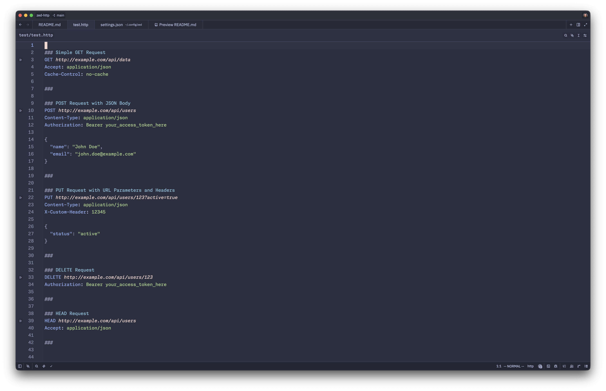
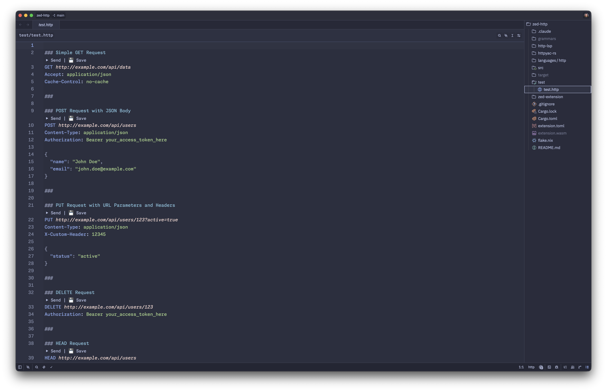

# http extension for Zed

`.http` file support for Zed: syntax highlighting, runnable requests, and an
optional LSP that wraps [httpyac](https://httpyac.github.io/) so request
execution, variable interpolation, scripts, assertions, and the rest of
httpyac's feature set work without leaving the editor.

The extension targets the JetBrains [HTTP request-in-editor
spec](https://github.com/JetBrains/http-request-in-editor-spec/blob/master/spec.md)
and the httpyac extensions on top of it.

## Features

- Syntax highlighting (`#`, `//`, and `/* */` comments, requests, headers,
  variables, response handlers, redirects).
- Embedded-language injections for JSON / XML / GraphQL request bodies and JS
  pre-request / response handler scripts.
- Outline view powered by `### request name` separators.
- Two ways to run requests:
  1. **Runnable tasks** (no LSP needed) — every `### …` request gets a Run
     button via Zed's runnable system; see [Tasks](#tasks) below.
  2. **LSP-driven code lens** — `▶ Send · 👁 Show · 💾 Save · ◉ Headers`
     buttons rendered above each request line; hover popups; code actions.
     Requires the [LSP](#optional-lsp) and httpyac.

## Install (extension)

`zed: install dev extension` and point at this directory. Zed will compile the
grammar (cloning `ToyVoDev/tree-sitter-http` at the pinned commit) and build
the extension wasm. That's enough for syntax highlighting and the runnable
tasks below.

## Tasks

Add this to `.zed/tasks.json` to wire the runnable tag emitted by the
extension to your CLI of choice (default example uses `httpyac`):

```json
[
  {
    "label": "Run HTTP Request",
    "command": "httpyac",
    "args": ["send", "--line", "$ZED_ROW", "$ZED_FILE"],
    "tags": ["http-request"],
    "reveal": "always"
  },
  {
    "label": "Run All HTTP Requests",
    "command": "httpyac",
    "args": ["send", "$ZED_FILE"],
    "tags": ["http-request"],
    "reveal": "always"
  }
]
```



## Optional LSP

The LSP gives you inline `▶ Send / 👁 Show / 💾 Save / ◉ Headers` buttons on
every request, plus a hover summary and code actions. It delegates execution
to httpyac, so variable interpolation, environment files, pre-request scripts,
assertions, gRPC/WS/etc. all work the same as the CLI does.



### Prerequisites

- `httpyac` on `PATH` — `npm install -g httpyac`, `nix profile install nixpkgs#httpyac`, etc.
- `zed-http-lsp` on `PATH` — see install options below.

### Install the LSP

**With cargo:**

```bash
cd zed-http
cargo install --path http-lsp
```

This puts `zed-http-lsp` in `~/.cargo/bin/`.

**With Nix:**

```bash
nix profile install github:ToyVoDev/zed-http
# or, from a checkout:
nix profile install .
```

This builds the `zed-http-lsp` package defined in `flake.nix`.

### Enable code lens in Zed

The LSP advertises itself automatically, but **code lens is off by default**
in Zed. Add this to your Zed settings to see the inline `▶ Send / 👁 Show /
💾 Save / ◉ Headers` buttons above each request:

```json
{
  "editor": {
    "code_lens": true
  }
}
```

(Code lens is the LSP protocol Zed routes through `workspace/executeCommand`
for clickable inline commands. Inlay hints look similar but don't fire any
command when clicked — Zed drops the `command` field on inlay-hint label
parts.)

If `zed-http-lsp` isn't on `PATH` (or you want to use a custom build), tell
Zed where to find it:

```json
{
  "lsp": {
    "zed-http-lsp": {
      "binary": { "path": "/absolute/path/to/zed-http-lsp" }
    }
  }
}
```

### Using the LSP

- Cursor inside a request → `Cmd-.` / `Ctrl-.` lists Send / Show / Save /
  Headers.
- Inlay hint buttons render next to each method line; click to invoke.
- Send writes the response to `~/.cache/zed-http/responses/<file>-line<N>-<ts>.http-resp`
  and opens it in a new pane.
- Save writes a permanent copy next to the source `.http` file.
- Hover shows the request's last response status and timing.

## Repository layout

```
zed-http/
├── src/                 wasm extension entry (language-server-command, runnables)
├── languages/http/      tree-sitter queries (highlights, injections, outline, runnables)
├── http-lsp/            zed-http-lsp binary crate
├── httpyac-rs/          Rust wrapper around the httpyac CLI
├── patches/             reference patch applied to ToyVoDev/tree-sitter-http
└── flake.nix            devShell + zed-http-lsp Nix package
```

The grammar is a fork at
[ToyVoDev/tree-sitter-http](https://github.com/ToyVoDev/tree-sitter-http) on
the `zed-http-patches` branch, fixing `//` comment absorption into raw bodies
and adding `/* */` block comments. See `patches/` for the diff.

## License

Apache-2.0.
